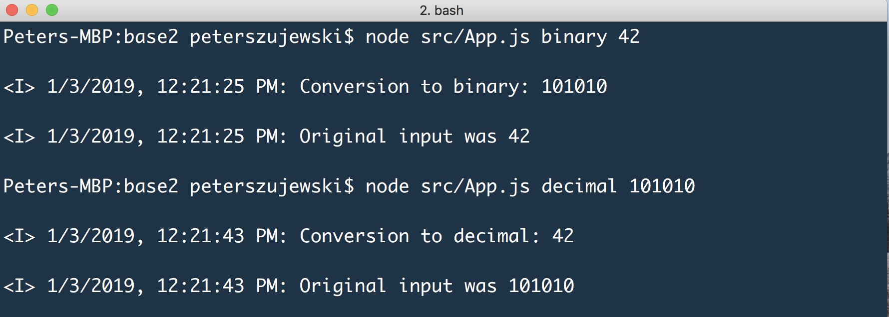

# base2 CLI

Converts base-10 numbers to base-2 numbers and vice versa. Usage is as follows:



To use on your machine, clone this repo and execute:

``` bash
# install dependencies
npm install

# compile typescript source code
npm run-script build

# execute compiled App
# node src/App.js <target> <digits>
# where target is one of 'binary' or 'decimal' (the number system you want to convert the digits to)
# digits are the 'digits' you want converted
node src/App.js binary 42

# should produce 101010
```

To run the tests:

```bash
npm run-script test
```

Thank you!